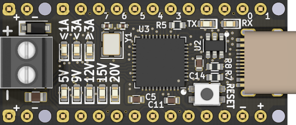
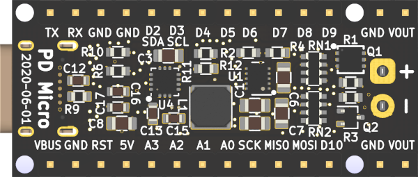
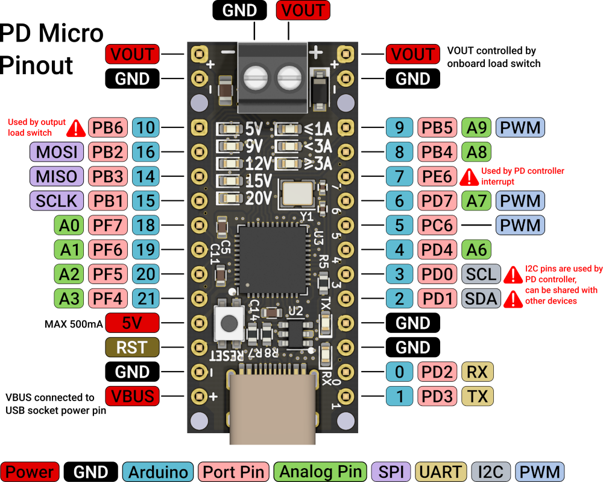
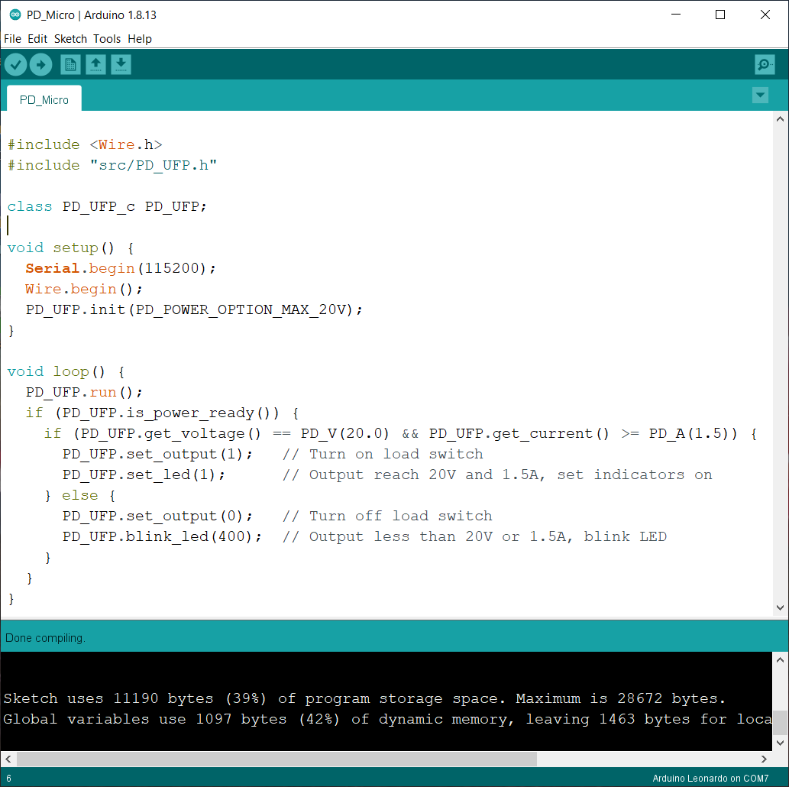
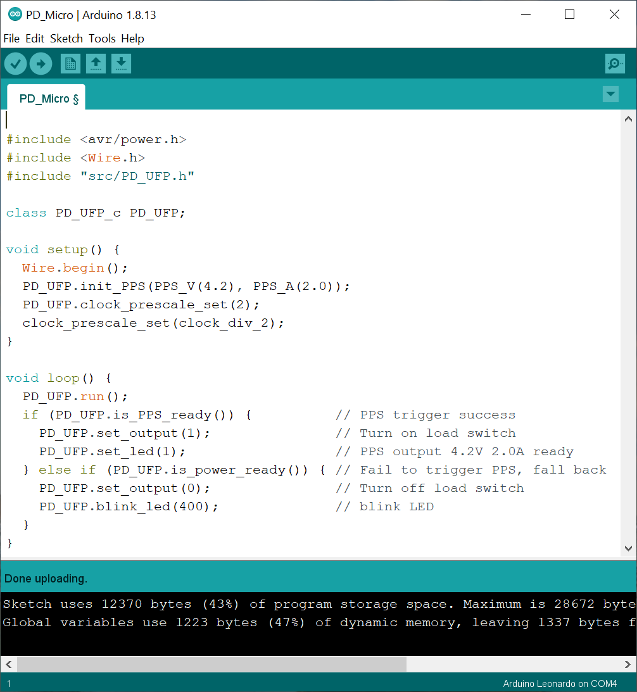
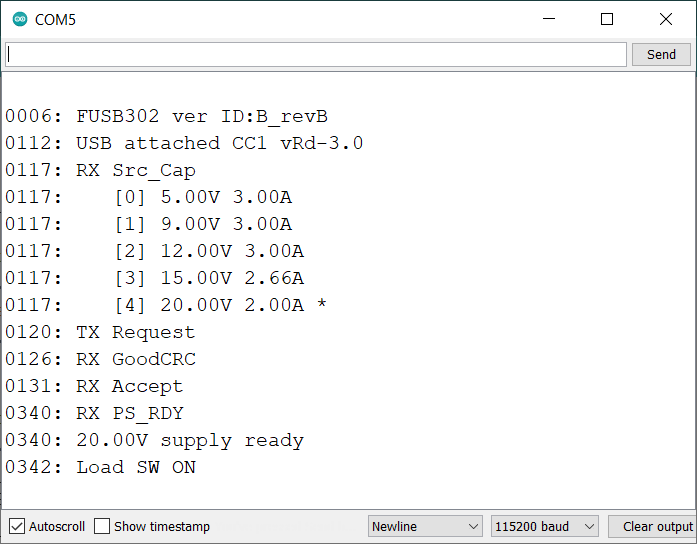
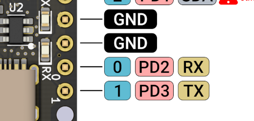
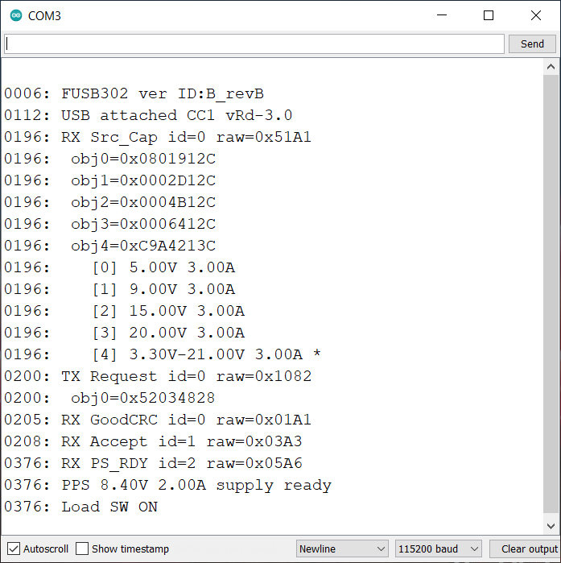

# PD_Micro
ATMega32U4 Arduino board with USB-C PD Power Delivery and PPS





## Specs:
- ATmega32U4 running at 5 V and 16 MHz
- FUSB302 USB-C PHY (USB PD communication on CC pins)
- TPS62175 DC-DC for 5-20V input, 5V 500mA max output
- On-board 30V 10.4A P-channel MOSFET load switch
- 5 LEDs for power delivery voltage level
- 3 LEDs for power delivery current level
- 3.5 mm, 2 position terminal block for power output
- 1.6 x 0.7 inches (0.3 inches longer than pro micro)




# Basic Usage

Open `PD_Micro.ino` with Arduino Sketch. Choose board `Arduino Leoardo`




## Set power option
Allocate a PD_UFP object
```
class PD_UFP_c PD_UFP;
```

Initialize it with one of the power options. That sets the maximum voltage/current. 
```
PD_UFP.init(PD_POWER_OPTION_MAX_20V);
```

```
enum PD_power_option_t {
    PD_POWER_OPTION_MAX_5V      = 0,
    PD_POWER_OPTION_MAX_9V      = 1,
    PD_POWER_OPTION_MAX_12V     = 2,
    PD_POWER_OPTION_MAX_15V     = 3,
    PD_POWER_OPTION_MAX_20V     = 4,
    PD_POWER_OPTION_MAX_VOLTAGE = 5,
    PD_POWER_OPTION_MAX_CURRENT = 6,
    PD_POWER_OPTION_MAX_POWER   = 7,
};
```

## Run USB PD state machine
Before USB PD negotiation had completed, `PD_UFP.run()` must be called in a short interval, less than 10ms, to ensure state machine response to negotiation message in time. Long response time may result in a power reset cycle initiated by USB PD hosts.

## Wait for USB PD negotiation completed
`PD_UFP.is_power_ready()` is set when
- PD negotiation completed, PD host sent a power ready message, or
- PD host not exist, CC pins voltage is checked and the power level determined.

The negotiation process typically takes less than a second.

## Examine the negotiated power value
Examine the negotiated power value. Turn on the load switch only when the power requirements are met. PD Micro itself does not have PD over current protection. Any excessive power usage may trigger USB PD host power protection, result in voltage dip and MCU reset. 

```
PD_UFP.run();
if (PD_UFP.get_voltage() == PD_V(20.0) && PD_UFP.get_current() >= PD_A(1.5)) {
  PD_UFP.set_output(1);   // Turn on load switch 
  PD_UFP.set_led(1);      // Output reach 20V and 1.5A, set indicators on
} else {
  PD_UFP.set_output(0);   // Turn off load switch
  PD_UFP.blink_led(400);  // Output less than 20V or 1.5A, blink LED
}
```
For Fix power option, `PD_UFP.get_voltage()` in 50 mV units and `PD_UFP.get_current()` in 10mA units. Use marco `PD_V` and `PD_A` to simplify conversion.

## Changing power option in run time
Power options can be changed any time after PD negotiation.
```
PD_UFP.set_power_option(PD_POWER_OPTION_MAX_20V);
```

`PD_UFP.is_ps_transition()` is set during power transition, clear when new power is ready. 
Power transition takes a maximum time of 550ms according to PD specifications. Depends on the power adapter, it is usually shorter.

# USB PD 3.0 PPS (Programmable Power Supply)
USB PD3.0 introduces a new PPS (Programmable Power Supply) mode. If PD source supports PPS, It allows devices to negotiate precise voltage range from 3.3V to 5.9/11/16/21 V with 20 mV step. PPS also supports a coarse current limit, with the value in 50 mA step.

The library provides another set of procedures to request PPS. If source PPS is not available or not qualified, it will fall back to use the regular PD power option.



## Set voltage and current on startup
Instead of using `PD_UFP.init()`, use `PD_UFP.init_PPS()` to setup PPS voltage in 20 mV units and PPS current in 50 mA units. Use marco `PPS_V()` and `PPS_A()` to simplify conversion.
```
PD_UFP.init_PPS(PPS_V(4.2), PPS_A(2.0));
```
The default fall-back PD power option is 5V. It can be changed by an extra parameter.
```
PD_UFP.init_PPS(PPS_V(4.2), PPS_A(2.0), PD_POWER_OPTION_MAX_9V);
```

PD Micro use ATMega32U4 with safe operation 8MHz @ <4.5V. To request PPS below 4.5V, use `clock_prescale_set(clock_div_2)` to slow down the working frequency, and use `PD_UFP.clock_prescale_set(2)` to prescale the library internal clock.
```
PD_UFP.clock_prescale_set(2);
clock_prescale_set(clock_div_2);
```

## Wait for USB PD PPS trigger completed
Once PD negotiation is completed,
- If PPS is available and qualified, `PD_UFP.is_PPS_ready()` is set. 
- If PPS is not available or qualified, `PD_UFP.is_power_ready()` is set.

If PPS is successfully triggered, the output voltage and current will be the exact value provided in the startup. It is not required to examine negotiated voltage and current.
```
PD_UFP.run();
if (PD_UFP.is_PPS_ready()) {          // PPS trigger success
  PD_UFP.set_output(1);               // Turn on load switch 
  PD_UFP.set_led(1);                  // PPS output 4.2V 2.0A ready
} else if (PD_UFP.is_power_ready()) { // Fail to trigger PPS, fall back
  PD_UFP.set_output(0);               // Turn off load switch
  PD_UFP.blink_led(400);              // blink LED
}
```
For PPS, `PD_UFP.get_voltage()` in 20 mV units and `PD_UFP.get_current()` in 50 mA units. Use marco `PPS_V()` and `PPS_A()` to simplify conversion.

## Changing PPS voltage and current in run time
PPS settings can be changed any time after PPS ready. Similar to `PD_UFP.init_PPS()`, set voltage in 20 mV units and current in 50 mA units. Use Marco `PPS_V()` and `PPS_A()` to simplify conversion.
```
PD_UFP.set_PPS(PPS_V(3.3), PPS_A(2.0));
```

`PD_UFP.is_ps_transition()` is set during power transition, clear when new power is ready. 
Power transition takes a maximum time of 550 ms according to specification. It is usually less than 50ms in PPS mode. 

By calling `PD_UFP.set_PPS()`, the library re-evaluates all PPS source capabilities to find the best fit. If it fails to find one, it returns false, no power request, and power transition will happen.

To exit PPS mode, call `PD_UFP.set_power_option()` to clear PPS setting and fall back to regular power option mode.

# LED Indicators
There are 5 LEDs for voltage and 3 LEDs for current on PD_Micro, multiplexed by 6 internal IO pins. These are managed by the PD_UFP library. 

The library turn on voltage LED according to the following table

| Voltage Range | LED | 
| --- | --- |
| >= 3.3V && < 9V | 5V | 
| >= 9V && < 12V | 9V | 
| >= 12V && < 15V | 12V | 
| >= 15V && < 20V | 15V | 
| >= 20 | 20V | 

# Debugging
The library can log library status, source capabilities, protocol packets, with timestamps in the millisecond step to the serial port.



To use it, allocate PD_UFP object with derived class `PD_UFP_log_c`
```
class PD_UFP_log_c PD_UFP;
```
initialize hardware serial1 in setup.
```
void setup() {
  Serial1.begin(115200);
  ...
```
call `PD_UFP.print_status(Serial1)` inside `loop()`.
```
void loop() {
  PD_UFP.run();
  PD_UFP.print_status(Serial1);
  ...
```
Connect Pin 1 (PD3 / UART TX) and GND to external USB to UART to read serial messages.



PD Micro can be converted to serial passthrough mode and use it as USB to UART. I included these Arduino sketch examples in <a href="/examples">examples</a> folder.

## Debug raw packets
The library provides two log levels. Initialize PD_UFP with extra parameter `PD_LOG_LEVEL_VERBOSE` to output raw packets
```
class PD_UFP_log_c PD_UFP(PD_LOG_LEVEL_VERBOSE);
```
```
enum pd_log_level_t {
    PD_LOG_LEVEL_INFO,
    PD_LOG_LEVEL_VERBOSE
};
```


# Bootloader
PD Micro uses `Caterina-promicro16.hex` bootloader provided by Sparkfun. Program it by `avrdude` and set the corresponding `efuse`.
```
avrdude -p m32u4 -P usb -c avrispmkii -U flash:w:Caterina-promicro16.hex -U efuse:w:0xcb:m -U hfuse:w:0xd8:m -U lfuse:w:0xff:m
```
